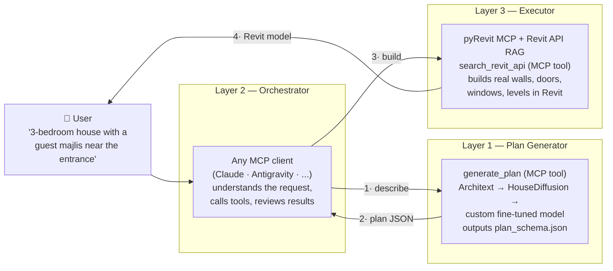

# TarkeebAI

**Text → Plan → BIM.** An open-source pipeline that turns a natural-language description of a house into real Revit geometry — walls, doors, windows, and levels — orchestrated by any MCP-capable AI agent (Claude, Antigravity, or others).

> 🏗️ Long-term goal: train and publish the **first floor-plan generation model specialized in Iraqi & Gulf residential typology** (guest/family separation, hosh courtyards, tarma porches, single-façade 10×20 plots) — a niche no existing dataset or model covers.

---

## The Problem

Modeling a residential floor plan in Revit is slow, repetitive work. Existing AI floor-plan generators output images or formats that can't drive BIM tools, and LLMs alone "hallucinate" geometry — they are great at language, terrible at exact coordinates.

## The Solution

Don't let the LLM invent geometry. Split the system into three layers, each doing only what it's good at:



| Layer | Role | Technology |
|---|---|---|
| **1. Plan Generator** | text / bubble diagram → rooms with exact JSON coordinates | Architext (phase 1) → HouseDiffusion (phase 2) → custom fine-tuned model (phase 3) |
| **2. Orchestrator** | understands the user, calls tools, reviews & corrects | any MCP client — **client-agnostic by design** |
| **3. Executor** | JSON → walls, doors, windows, floors inside Revit | pyRevit MCP + a local RAG database of the Revit 2025 API |

The shared contract between all layers is a single file: [`schema/plan_schema.json`](schema/plan_schema.json).

## What works today (v0.0 — Foundation)

- ✅ **`revit-rag` MCP server** — semantic search over the full Revit 2025 API documentation, fully local (ChromaDB + Snowflake Arctic embeddings, no paid API keys). See [`mcp-servers/revit-rag/`](mcp-servers/revit-rag/).
- ✅ **`plan_schema.json`** — the unified plan format (rooms, walls, doors, windows, levels) that every later phase builds on.
- ✅ Example plan in [`examples/`](examples/) showing the schema in practice.

## Quick start

```bash
git clone https://github.com/<your-username>/TarkeebAI.git
cd TarkeebAI
pip install -r mcp-servers/revit-rag/requirements.txt
# download the prebuilt RAG database → see docs/getting-started.md
python mcp-servers/revit-rag/revit_rag_server.py
```

Full step-by-step setup (database download, MCP client registration, configuration): **[docs/getting-started.md](docs/getting-started.md)**.

## Repository structure

```
TarkeebAI/
├── mcp-servers/
│   └── revit-rag/            # MCP server: Revit 2025 API semantic search
│       ├── revit_rag_server.py
│       ├── config.example.json
│       └── requirements.txt
├── schema/
│   └── plan_schema.json      # The unified plan format (backbone of the project)
├── examples/
│   └── iraqi_house_10x20.json
├── docs/
│   └── getting-started.md
└── data/
    └── revit_db/             # ChromaDB database (downloaded separately, git-ignored)
```

## Roadmap

| Phase | Goal | Deliverable |
|---|---|---|
| **0 — Foundation** ✅ | clean open-source repo | this repo |
| **1 — First pipeline** | text → Revit with Architext (162M) | demo video, v0.1 |
| **2 — Quality upgrade** | vector plans via HouseDiffusion | v0.2, before/after comparison |
| **3 — Iraqi model** | 300–600 plan dataset + LoRA fine-tune (Qwen2.5-3B) | model + dataset on HuggingFace |
| **4 — Packaging** | case study, outreach | PDF case study |

## Credits

- The prebuilt Revit 2025 API RAG database comes from [RevitGeminiRAG](https://github.com/ismail-seleit/RevitGeminiRAG) by Ismail Seleit (MIT).
- Embeddings: [Snowflake Arctic Embed L v2.0](https://huggingface.co/Snowflake/snowflake-arctic-embed-l-v2.0).

## License

[MIT](LICENSE)
