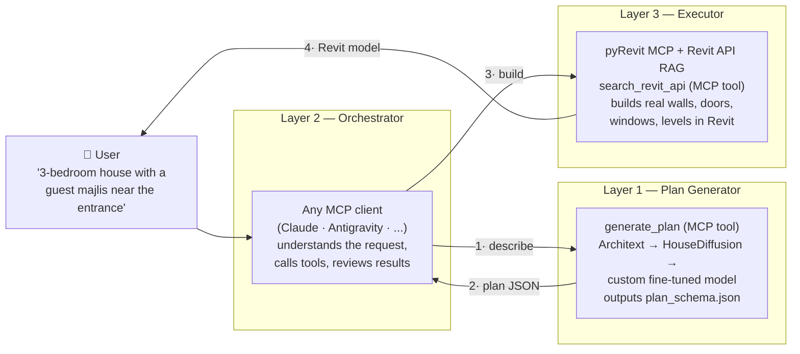

# TarkeebAI

**Text → Plan → BIM.** An open-source pipeline that turns a natural-language description of a house into real Revit geometry — walls, doors, windows, and levels — orchestrated by any MCP-capable AI agent (Claude, Antigravity, or others).

> 🏗️ Long-term goal: train and publish the **first floor-plan generation model specialized in Iraqi & Gulf residential typology** (guest/family separation, hosh courtyards, tarma porches, single-façade 10×20 plots) — a niche no existing dataset or model covers.

---

## The Problem

Modeling a residential floor plan in Revit is slow, repetitive work. Existing AI floor-plan generators output images or formats that can't drive BIM tools, and LLMs alone "hallucinate" geometry — they are great at language, terrible at exact coordinates.

## The Solution

Don't let the LLM invent geometry. Split the system into three layers, each doing only what it's good at:



| Layer | Role | Technology |
|---|---|---|
| **1. Plan Generator** | text / bubble diagram → rooms with exact JSON coordinates | Architext (phase 1) → HouseDiffusion (phase 2) → custom fine-tuned model (phase 3) |
| **2. Orchestrator** | understands the user, calls tools, reviews & corrects | any MCP client — **client-agnostic by design** |
| **3. Executor** | JSON → walls, doors, windows, floors inside Revit | pyRevit MCP + a local RAG database of the Revit 2025 API |

The shared contract between all layers is a single file: [`schema/plan_schema.json`](schema/plan_schema.json).

## What works today (v0.1 — first complete pipeline)

- ✅ **`plan-generator` MCP server** — `generate_plan`: natural-language description → floor-plan JSON (Architext gptj-162M, runs locally on CPU), plus `validate_plan` for schema checking. See [docs/phase-1-pipeline.md](docs/phase-1-pipeline.md).
- ✅ **`revit-rag` MCP server** — `search_revit_api`: semantic search over the full Revit 2025 API documentation, fully local (ChromaDB + Snowflake Arctic embeddings, no paid API keys).
- ✅ **HouseDiffusion bridge (Phase 2)** — `plan_from_bubble_diagram`: a higher-quality *vector* generator driven by a room-adjacency **bubble diagram** (the orchestrating LLM writes the graph from text — no CLIP needed; HouseDiffusion consumes a graph, not images). The reusable bridge + a ready Colab notebook ship here; the GPU model run is documented in [docs/phase-2-housediffusion.md](docs/phase-2-housediffusion.md).
- ✅ **`plan_schema.json`** — the unified plan format (rooms, walls, doors, windows, levels) that every later phase builds on.
- ✅ **Ready-made MCP configs** — [`.mcp.json`](.mcp.json) (picked up automatically by Claude Code) and [`mcp-config.example.json`](mcp-config.example.json) for Claude Desktop / Antigravity / Cursor. See [docs/connect-mcp-clients.md](docs/connect-mcp-clients.md).
- ✅ Example plan in [`examples/`](examples/) showing the schema in practice.

## Setup from zero

Everything below was verified on a fresh clone. You need: **Python 3.10+**, **git**, ~6 GB free disk. No GPU, no API keys.

### Step 1 — Clone and install (one command)

```bash
git clone https://github.com/mhmdTaqi-code/PlanForgeRevit.git
cd PlanForgeRevit
python -m venv .venv
# Windows:           .venv\Scripts\activate
# Linux/macOS:       source .venv/bin/activate
pip install -r requirements.txt
```

### Step 2 — Where do the models go? (mostly: nowhere — they place themselves)

| Component | You put it... | |
|---|---|---|
| Architext (plan generation, ~650 MB) | **nowhere** — auto-downloads to the HuggingFace cache (`~/.cache/huggingface`) on first use | automatic |
| Arctic embeddings (~1.2 GB) | **nowhere** — same, auto-downloads on first search | automatic |
| Revit API database (~700 MB) | `data/revit_db/` — **the only manual download**, exact layout in step 4 | manual |

Details, links and hardware requirements: [docs/models-and-data.md](docs/models-and-data.md).

### Step 3 — First plan (works immediately, nothing else needed)

```bash
python mcp-servers/plan-generator/test_parser.py        # offline self-check, instant
python mcp-servers/plan-generator/plan_generator_server.py --test "a house with three bedrooms and two bathrooms"
```

The second command downloads Architext on first run, then prints a complete floor-plan JSON + `schema validation: OK`.

### Step 4 — The Revit API database (the one manual download)

Download the 6 assets from [this release](https://github.com/ismail-seleit/RevitGeminiRAG/releases/tag/v1.0.0-database) and arrange them **exactly** like this — the five index files go inside a folder you create, named with this exact UUID:

```
data/revit_db/
├── chroma.sqlite3
└── 1ccb803a-3d67-4028-a8e8-35b549456170/
    ├── data_level0.bin
    ├── header.bin
    ├── index_metadata.pickle
    ├── length.bin
    └── link_lists.bin
```

If you get it wrong, the server tells you the exact fix at startup. Full guide: [docs/getting-started.md](docs/getting-started.md).

### Step 5 — Connect to your AI agent (where the MCP config goes)

| Your agent | Where the config goes |
|---|---|
| **Claude Code** | nowhere — it auto-detects [`.mcp.json`](.mcp.json) when you open this folder |
| **Claude Desktop** | `%APPDATA%\Claude\claude_desktop_config.json` (Windows) / `~/Library/Application Support/Claude/claude_desktop_config.json` (macOS) |
| **Antigravity** | `~/.gemini/config/mcp_config.json` |
| **Cursor** | `~/.cursor/mcp.json` |

For everything except Claude Code: copy the two entries from [`mcp-config.example.json`](mcp-config.example.json), replace `<REPO>` with this folder's absolute path, restart the app. Your agent now has `generate_plan`, `validate_plan`, and `search_revit_api`. Full per-client guide: [docs/connect-mcp-clients.md](docs/connect-mcp-clients.md).

### Step 6 — (Optional) Build into Revit

Install a pyRevit MCP extension (e.g. [revit-mcp-server](https://github.com/Demolinator/revit-mcp-server)) so the agent can execute inside Revit. pyRevit loads extensions from directories you register — clone the extension as a `*.extension` folder anywhere, then run `pyrevit extensions paths add "<parent-dir>"` and reload (full steps in [docs/connect-mcp-clients.md](docs/connect-mcp-clients.md#the-executor-pyrevit-mcp-extension)). Then use the ready-made orchestration prompt from [docs/connect-mcp-clients.md](docs/connect-mcp-clients.md#recommended-orchestration-prompt). Walkthrough: [docs/phase-1-pipeline.md](docs/phase-1-pipeline.md).

## Repository structure

```
TarkeebAI/
├── .mcp.json                 # MCP config — auto-detected by Claude Code
├── mcp-config.example.json   # MCP config template for other clients
├── mcp-servers/
│   ├── plan-generator/       # MCP server: text → floor-plan JSON
│   │   ├── plan_generator_server.py   # generate_plan (Architext) + plan_from_bubble_diagram (HouseDiffusion)
│   │   ├── test_parser.py
│   │   ├── housediffusion/   # Phase 2 bridge: bubble diagram ⇄ HouseDiffusion ⇄ plan_schema
│   │   │   ├── graph_to_model_input.py
│   │   │   ├── model_output_to_plan.py
│   │   │   ├── engine.py
│   │   │   └── test_bridge.py
│   │   ├── config.example.json
│   │   └── requirements.txt
│   └── revit-rag/            # MCP server: Revit 2025 API semantic search
│       ├── revit_rag_server.py
│       ├── config.example.json
│       └── requirements.txt
├── AIProjects/
│   └── house_diffusion/      # vendored HouseDiffusion source (run on GPU/Colab)
├── notebooks/
│   └── HouseDiffusion_TarkeebAI.ipynb   # Colab: bubble diagram → plan_schema.json
├── skills/
│   └── bim-best-practices/   # Agent skill: Iraqi residential BIM standards in Revit
│       ├── SKILL.md
│       ├── scripts/          # idempotent pyRevit scripts (wall catalog, joins, validator)
│       └── references/       # Iraqi construction standards reference
├── schema/
│   ├── plan_schema.json          # The unified plan format (backbone of the project)
│   └── bubble_diagram_schema.json # HouseDiffusion input: rooms + adjacencies
├── examples/
│   └── iraqi_house_10x20.json
├── docs/
│   ├── getting-started.md
│   ├── phase-1-pipeline.md
│   ├── phase-2-housediffusion.md
│   ├── connect-mcp-clients.md
│   └── models-and-data.md
└── data/
    └── revit_db/             # ChromaDB database (downloaded separately, git-ignored)
```

## Agent skills

[`skills/bim-best-practices/`](skills/bim-best-practices/) packages Iraqi residential BIM expertise as a reusable agent skill: it creates the standard Iraqi multi-layer wall catalog (cement plaster → thermostone/brick → gypsum plaster), enforces column-to-wall joins, and validates wall thicknesses/naming against the standard set — all through the pyRevit MCP executor. It complements the pipeline: `generate_plan` invents the layout, the executor builds it, and this skill makes the result **constructionally correct**, not just geometrically present.

To use it with Claude Code, copy the folder into your skills directory (or point your agent at [`SKILL.md`](skills/bim-best-practices/SKILL.md) directly).

## Roadmap

| Phase | Goal | Deliverable |
|---|---|---|
| **0 — Foundation** ✅ | clean open-source repo | this repo |
| **1 — First pipeline** ✅ | text → Revit with Architext (162M) | `generate_plan` tool, v0.1 |
| **2 — Quality upgrade** 🚧 | vector plans via HouseDiffusion (bridge + `plan_from_bubble_diagram` tool + Colab notebook shipped; GPU run + before/after comparison next) | v0.2 |
| **3 — Iraqi model** | 300–600 plan dataset + LoRA fine-tune (Qwen2.5-3B) | model + dataset on HuggingFace |
| **4 — Packaging** | case study, outreach | PDF case study |

## Credits

- Plan generation: [Architext](https://huggingface.co/architext/gptj-162M) by Theodoros Galanos et al. ([paper](https://arxiv.org/abs/2303.07519)).
- The prebuilt Revit 2025 API RAG database comes from [RevitGeminiRAG](https://github.com/ismail-seleit/RevitGeminiRAG) by Ismail Seleit (MIT).
- Embeddings: [Snowflake Arctic Embed L v2.0](https://huggingface.co/Snowflake/snowflake-arctic-embed-l-v2.0).

## License

[MIT](LICENSE)
